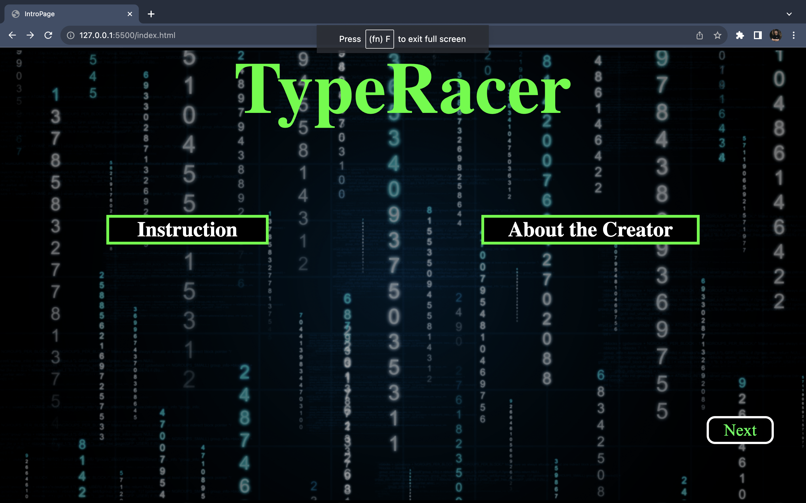
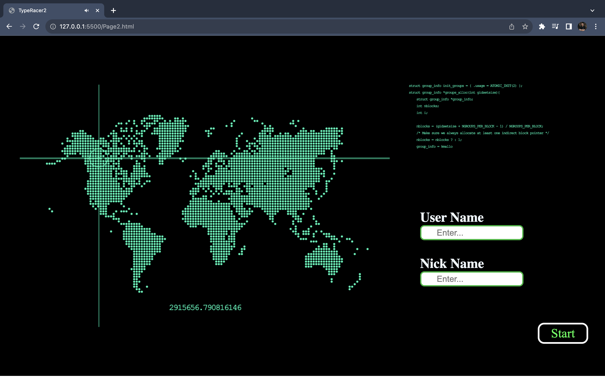
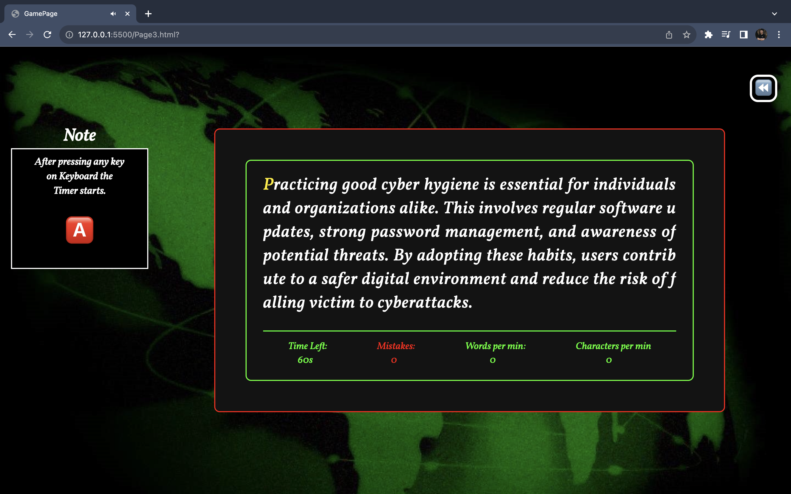
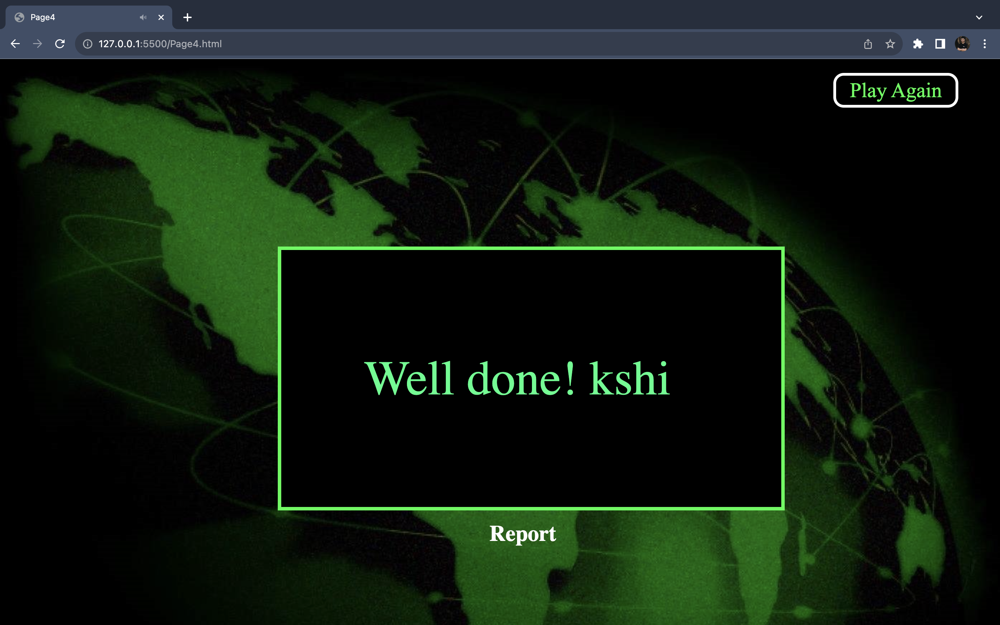

# Typeracer Game

You Can Play the Game Here : https://6562550e143ed16d009488f9--boisterous-biscuit-0164c9.netlify.app/

# Game Idea : 

TypeRacer is not just a game, it's a journey to enhance your typing skills in the most fun and competitive way! 🎮 Test your typing speed with real-time measurements, including words per minute (WPM) and characters per minute (CPM). Whether you're a keyboard maestro or just starting, TypeRacer offers an exciting space to refine your typing skills.

# How To Play : 

## Step 1: Enter Your Name and Nickname

1. Open the game and navigate to the second page.
2. Input your name and nickname.
3. Note: Only letters are allowed; no numbers or symbols.

## Step 2: Ready, Set, Type!

1. Move to the third page after entering your details.
2. Get ready for the typing challenge.
3. A yellow letter indicates the current one to type.
4. As soon as you hit any key, the timer starts.
5. Green letters show your correctly typed characters.
6. Red letters indicate mistakes; type carefully!

## Step 3: Embrace the Challenge

1. Reload the third page for a new paragraph.
2. Each reload brings a fresh typing challenge.
3. The timer resets, and the game begins anew.
4. Improve your typing skills with every round.
5. Embrace the rhythm of the keys and conquer the typing world!

Now, dive in and see how fast and accurately you can type! 🚀 💻

# Tech Stack Used : Vanilla HTML, CSS, JAVASCRIPT.

# Screens in the Game : 
1. First Page of the Game : 

2. Second Page of the Game : 

3. Third Page of the Game : 

4. Fourth Page of the Game: 

# References :

1. I have Used Google to get background Image for my Game. 

2. I have used these websites for the background music in the Game

   a. https://mixkit.co/free-sound-effects/click/

   b. https://audiojungle.net/search/hacking

   c. https://pixabay.com/music/search/hacker/

# Note - As I have so many assets after making the zip file it is not uploading on github as it is showing the file should be less than 25 Mb. So i am not makinga a zip
